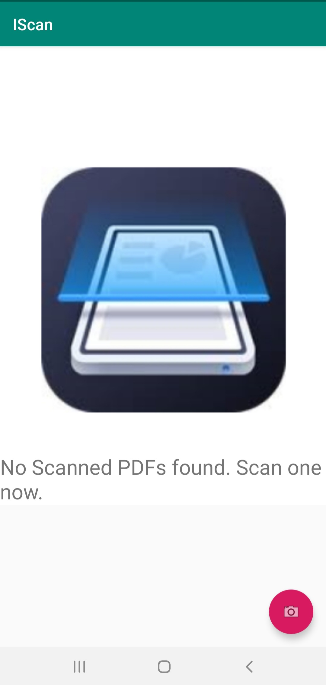
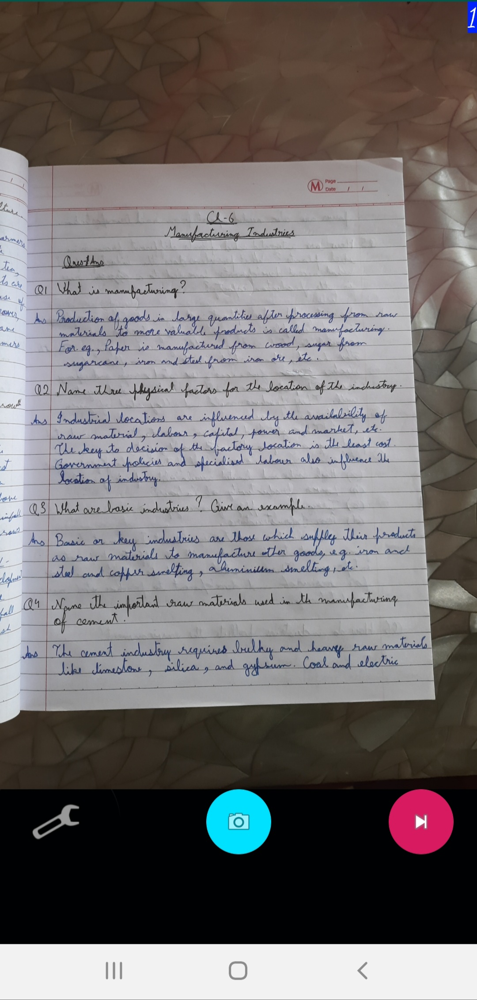
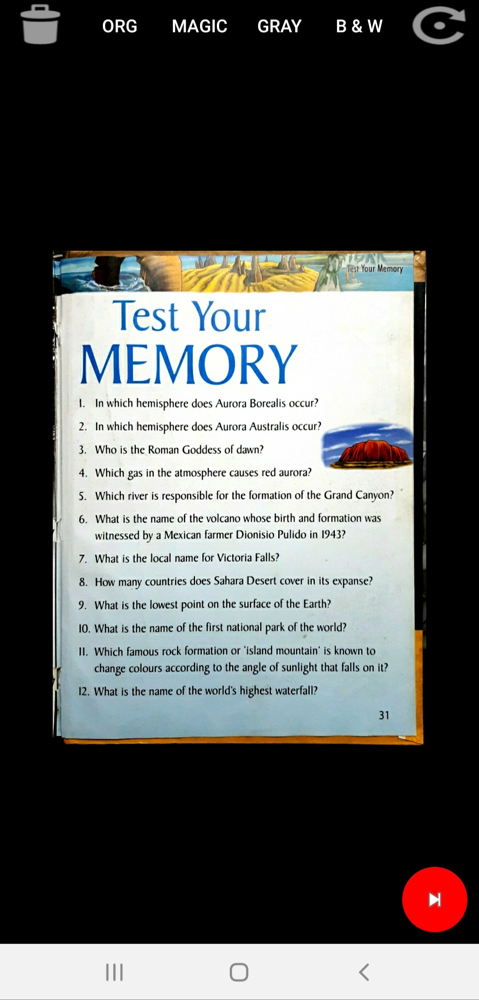
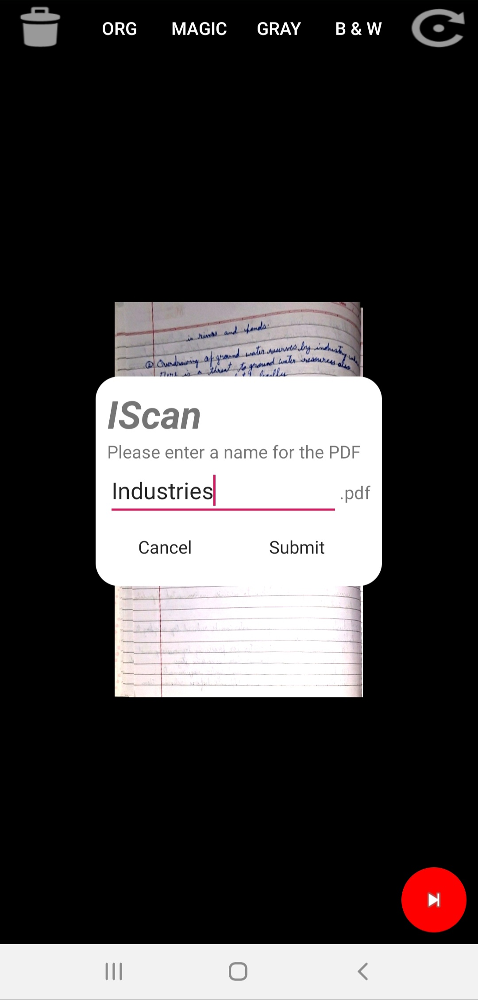
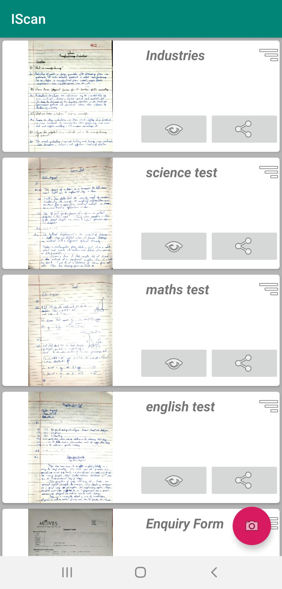

# IScan
The Indian Scanner App - Made for the Indians, By the Indians 
Official website: [https://nalinstudios.herokuapp.com/IScan](https://nalinstudios.herokuapp.com/IScan)   

IScan - The Indian Scanner app, Made for Indians, By an Indian. 
This is a purely Indian Scanner app that provides you with an easy to use interface, quick usage and completely safe way of scanning as PDFs, Saving and Sharing them.
Scan High-Quality PDFs quickly and efficiently by using IScan, that is a Lightweight, Fast, and Efficient Document Scanner. This app turns your Android device into a fast, lightweight and portable document scanner. This application allows you to easily scan documents and share them using your preferred mode of file sharing. The true power of this application is that it is an open source and would readily accept any Modifications, Upgrades, Feature Requests and Bug Fixes.
  
Features:  

* Use this app easily and quickly, thanks to the simple and fast User Interface. 
* Scan documents in high quality. 
* Improve the scan quality automatically/Manually. 
* Enhance your PDFs by cropping and applying effects. 
* Enhance your scans into clear and sharp PDF. 
* Share PDF files after scanning. 
* Ads? What are those? We provide you a completely ad free experience to boost your productivity. 
* A fast user interface has been developed as we value your time. 
* Completely secure environment. We do not take any of your information with us and we respect your privacy. 
  
IScan is a free to use and completely offline PDF Creator which makes scanning documents easy while ensuring complete security of your data. IScan is a perfect app to work as a camera scanner, document scanner or for multi-page PDF scanning.
  
What’s better than knowing what an app does and what things it has access to. Based on the Open-Source philosophy, the source of our app is kept completely open, so you have the right and access to check out what it does and if it is good and safe for you or your business.
  
If you ever feel that there is any bug in the Application, you can report that bug and even collaborate with us on this project and provide one of the best experiences to every user of this application.
  
Visit https://nalinstudios.herokuapp.com/IScan for more details.   

  
# Screenshots:

    

        
        
        
        
        
        
    

  
# Developer Zone:
This project is based upon a customized version of NeutrinosPlatform's scanLibrary at https://github.com/NeutrinosPlatform/scanlibrary .
### Setting up native libraries:

Uncompress the jniLibs.7z from IScan/app/src/main/ using 7-Zip to IScan/app/src/main/jniLibs. Your directory structure should look something like this:
~~~shell
main\
    +- java
    |
    +- res
    |
    +- jniLibs\
    |         +- arm64-v8a\
    |         |           +-libopencv_java3.so
    |         |           +-libScanner.so
    |         +- armeabi\
    |         |         +-libopencv_java3.so
    |         |         +-libScanner.so
    |         +- ....
    |
    +- AndroidManifest.xml
~~~

If you need the documentation for the code of this project you can get it **[here](https://nalin-2005.github.io/IScan)**
